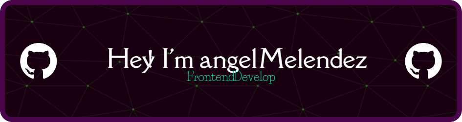

##  Bienvenid@ 
---

 <h2>Tecnologias 💻</h2> 

  
 

 <h3>Estadisticas del repositorio</h3> 

  
  
  

<!--
 https://ang3lcode.github.io/tranformaciones-y-transiciones-css/     conteo conejos
 
 https://ang3lcode.github.io/curso-frontend-developer-javascript-practico/ curso javascript
 
 https://ang3lcode.github.io/mokepon/    mokepon
 
 https://ang3lcode.github.io/Responsive-Design-Maquetaci-n-Mobile-First/   maquetacion
 
 https://ang3lcode.github.io/1-repositorio-wikipedia-copi/   copia wiki
 
 https://ang3lcode.github.io/Bootstrap-viaje/ bootstrap
 
 https://ang3lcode.github.io/tailwindcss/  tailwind
 
 https://ang3lcode.github.io/Async-landing/ asincronismo -->

<!-- estadisticas v2

  <a href="https://github.com/ang3lcode">
  
  

-->
  
 
<!--
**ang3lcode/ang3lcode** is a ✨ _special_ ✨ repository because its `README.md` (this file) appears on your GitHub profile.

Here are some ideas to get you started:

- 🔭 I’m currently working on ...
- 🌱 I’m currently learning ...
- 👯 I’m looking to collaborate on ...
- 🤔 I’m looking for help with ...
- 💬 Ask me about ...
- 📫 How to reach me: ...
- 😄 Pronouns: ...
- ⚡ Fun fact: ...
-->
<!-- 
  <code></code>
  <code></code>
  <code></code>
   
  <code></code>
  <code></code>
  <code></code>
   
  <code></code>
  <code></code>
  <code></code>
   
  <code></code>
  <code></code>
  <code></code>
-->